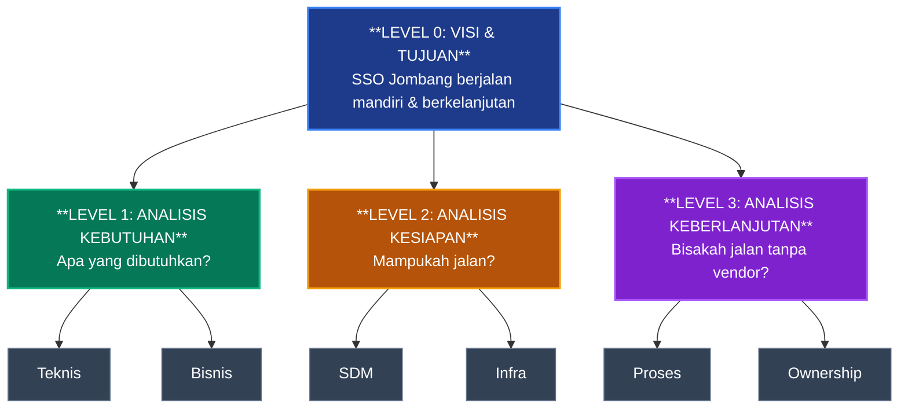
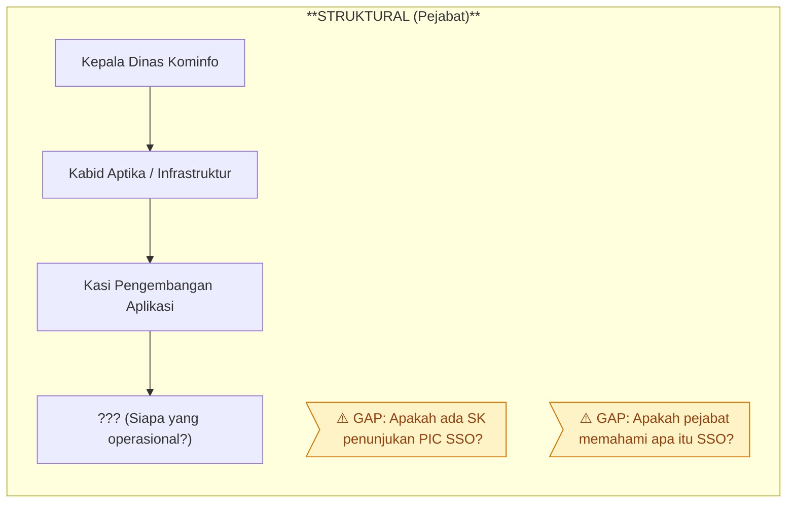
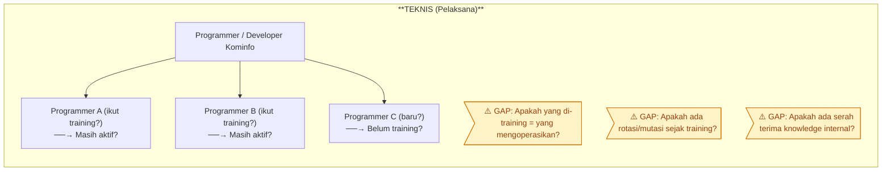
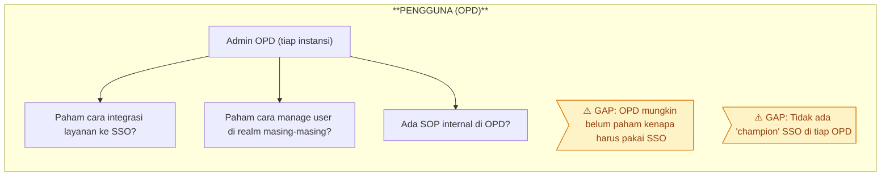
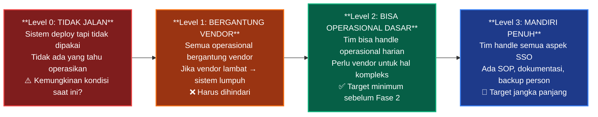

# Analisis Gap: Struktural & Delegasi Person
## Proyek SSO Kabupaten Jombang — Evaluasi Kesiapan Fase 2

**Tanggal:** 2 Oktober 2026
**Konteks:** Sistem SSO (Fase 1) sudah selesai dibangun dan di-training, namun belum berjalan optimal di sisi klien. Diperlukan analisis mendalam sebelum melanjutkan ke Fase 2 (Mobile).

---

## I. Hierarki Analisis — Dari Kebutuhan Hingga Keberlanjutan

---

## II. Level 1 — Analisis Kebutuhan (Apa yang Dibutuhkan?)

### A. Kebutuhan Teknis

| **No** | **Kebutuhan** | **Status Fase 1** | **Gap?** |
|---|---|---|---|
| 1 | Server Keycloak aktif & stabil | ✅ Sudah deploy | ⏳ Perlu cek uptime & health |
| 2 | Konfigurasi realm & client benar | ✅ Sudah setup | ⏳ Perlu audit konfigurasi |
| 3 | SSL/TLS certificate valid | ✅ Sudah pasang | ⏳ Perlu cek masa berlaku |
| 4 | Database backend stabil | ✅ Sudah setup | ⏳ Perlu cek kapasitas & backup |
| 5 | API endpoint berjalan | ✅ Sudah develop | ⏳ Perlu cek availability |
| 6 | Dokumentasi teknis lengkap | ❓ Belum dikonfirmasi | ⚠️ Kemungkinan gap besar |

### B. Kebutuhan Bisnis / Proses

| **No** | **Kebutuhan** | **Status** | **Gap?** |
|---|---|---|---|
| 1 | SOP operasional SSO harian | ❓ Belum dikonfirmasi | ⚠️ Kemungkinan belum ada |
| 2 | SOP troubleshooting & eskalasi | ❓ Belum dikonfirmasi | ⚠️ Kemungkinan belum ada |
| 3 | Integrasi OPD ke SSO | ❓ Parsial | ⚠️ Belum semua OPD terintegrasi |
| 4 | Alur pendaftaran user SSO | ✅ Sudah ada | ⏳ Perlu evaluasi |

---

## III. Level 2 — Analisis Kesiapan (Mampukah Jalan?)

### A. Kesiapan SDM — Hierarki Person & Delegasi

### B. Matriks Delegasi — Siapa Bertanggung Jawab Apa?

| **Fungsi** | **Seharusnya** | **Kondisi Saat Ini** | **Gap** |
|---|---|---|---|
| **Admin Keycloak** (manage realm, client, user) | Programmer Kominfo yang sudah training | ❓ Tidak jelas siapa | ⚠️ Kritis |
| **Monitoring Server** (uptime, health check) | Tim Infrastruktur / DevOps Kominfo | ❓ Tidak jelas siapa | ⚠️ Kritis |
| **Troubleshooting** (error login, token issue) | Programmer Kominfo | ❓ Tidak jelas siapa | ⚠️ Kritis |
| **Integrasi OPD Baru** (daftarkan client baru) | Programmer Kominfo + Admin OPD | ❓ Belum ada prosedur | ⚠️ Sedang |
| **Pengambil Keputusan** (approval, eskalasi) | Kabid/Kasi Aptika | ❓ Perlu dikonfirmasi | ⚠️ Sedang |
| **Koordinasi dengan Vendor** (jika ada masalah) | PIC Proyek dari Kominfo | ❓ Tidak jelas siapa | ⚠️ Sedang |

---

## IV. Level 3 — Analisis Keberlanjutan (Bisakah Jalan Tanpa Vendor?)

### Checklist Kemandirian

| **No** | **Kriteria Kemandirian** | **Indikator** | **Status** |
|---|---|---|---|
| 1 | **Bisa restart server sendiri** | Tim Kominfo tahu cara restart Keycloak jika down | ❓ Perlu cek |
| 2 | **Bisa troubleshoot error dasar** | Tim bisa baca log, identifikasi error umum (401, 403, token expired) | ❓ Perlu cek |
| 3 | **Bisa tambah client baru** | Tim bisa registrasi client baru di Keycloak tanpa bantuan vendor | ❓ Perlu cek |
| 4 | **Bisa manage user** | Tim bisa create/disable/reset password user di Keycloak | ❓ Perlu cek |
| 5 | **Bisa backup & restore** | Tim tahu cara backup database Keycloak dan restore jika perlu | ❓ Perlu cek |
| 6 | **Bisa update/patch** | Tim bisa update versi Keycloak jika ada security patch | ❓ Perlu cek |
| 7 | **Ada dokumentasi internal** | Ada catatan/wiki internal tentang konfigurasi SSO Jombang | ❓ Perlu cek |
| 8 | **Ada SOP eskalasi** | Ada prosedur jelas: siapa dihubungi jika sistem down | ❓ Perlu cek |

### Skala Kematangan (Maturity Level)

---

## V. Rekomendasi Tindakan Sebelum Fase 2

### Prioritas Tinggi (Harus Selesai Sebelum Kick-off Mobile)

| **No** | **Aksi** | **Tujuan** | **PIC** |
|---|---|---|---|
| 1 | **Audit teknis SSO** — cek server, Keycloak, database, SSL | Pastikan fondasi Fase 1 berjalan baik | Lead Dev + Kominfo |
| 2 | **Mapping person** — identifikasi siapa yang di-training dulu vs siapa yang pegang sekarang | Identifikasi knowledge loss | PM + Kominfo |
| 3 | **Assessment kompetensi** — tes singkat kemampuan programmer Kominfo soal Keycloak | Ukur level kesiapan SDM | Lead Dev |
| 4 | **Penunjukan PIC SSO resmi** — minta SK dari Kadis Kominfo | Pastikan ada ownership yang jelas | Kadis Kominfo |
| 5 | **Buat SOP Operasional SSO** — minimal: monitoring, troubleshooting, eskalasi | Pastikan ada prosedur standar | PM + Kominfo |

### Prioritas Sedang (Bisa Paralel dengan Minggu 1–2 Fase 2)

| **No** | **Aksi** | **Tujuan** | **PIC** |
|---|---|---|---|
| 6 | **Refresh training Keycloak** (1–2 sesi) | Tutup gap knowledge yang hilang | Lead Dev |
| 7 | **Dokumentasi ulang** — update/lengkapi docs teknis SSO | Buat reference yang bisa dipakai mandiri | Lead Dev + Kominfo |
| 8 | **Tentukan "SSO Champion"** di tiap OPD | Pastikan ada contact person per instansi | Kominfo + OPD |

---

## VI. Pertanyaan Kunci untuk Rakor

> Pertanyaan-pertanyaan ini **wajib dijawab** sebelum Fase 2 dimulai:

1. **"Siapa yang saat ini bertanggung jawab atas operasional SSO sehari-hari?"**
   → Jika jawabannya *"tidak ada"* atau *"tidak jelas"*, ini red flag utama.

2. **"Apakah orang yang mengikuti training SSO dulu masih menjabat di posisi yang sama?"**
   → Jika sudah mutasi, perlu identifikasi siapa pengganti dan apakah sudah ada transfer knowledge.

3. **"Apa yang terjadi ketika SSO down? Siapa yang handle?"**
   → Jika jawabannya *"hubungi vendor"*, berarti masih di Level 1 (bergantung vendor).

4. **"Apakah sudah ada SK penunjukan PIC SSO dari Kadis Kominfo?"**
   → Tanpa SK formal, ownership akan selalu abu-abu.

5. **"Berapa persen OPD yang sudah aktif menggunakan SSO untuk layanan mereka?"**
   → Jika rendah, masalahnya bukan cuma teknis tapi juga adopsi/sosialisasi.

---

> **Kesimpulan:** Sebelum melangkah ke Fase 2 (Mobile), kita perlu memastikan fondasi Fase 1 (SSO) benar-benar kokoh — bukan hanya dari sisi teknis, tapi juga dari sisi **struktural, person, dan proses**. Tanpa ini, aplikasi mobile yang dibangun di atas SSO yang rapuh hanya akan menambah masalah baru.
